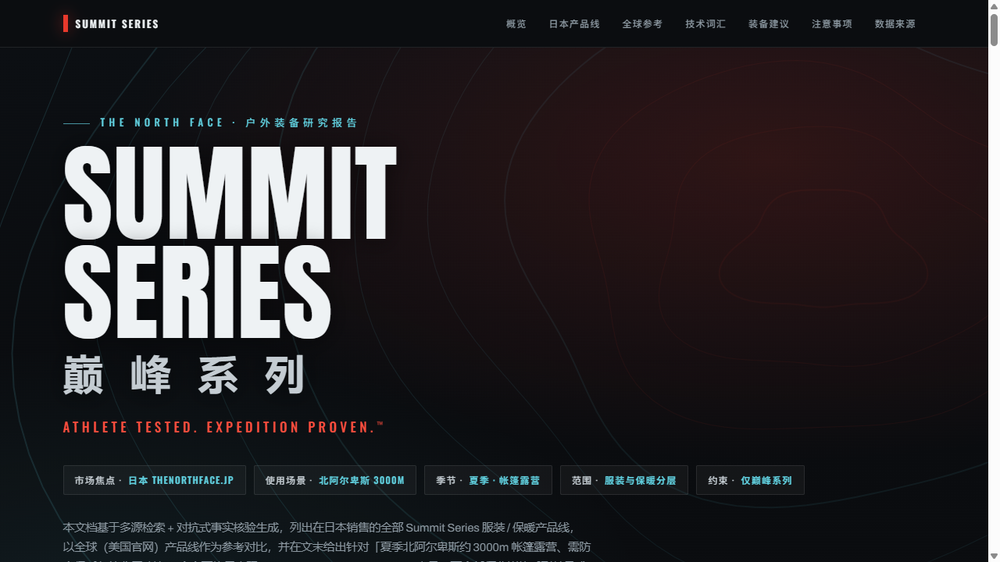

<div align="center">

# 🏔️ The North Face 巅峰系列 · 高山分层指南

**ATHLETE TESTED. EXPEDITION PROVEN.™**

在日本销售的 The North Face **Summit Series（巅峰系列 / サミットシリーズ）** 服装与保暖产品线，
全球（美国官网）产品线参考对比，以及针对 **「日本北阿尔卑斯约 3000m 夏季帐篷露营」** 的服装与保暖分层建议。

[](https://newbdez33.github.io/north-face-summit-series-japan/)
&nbsp;

&nbsp;


### 👉 [newbdez33.github.io/north-face-summit-series-japan](https://newbdez33.github.io/north-face-summit-series-japan/)

[](https://newbdez33.github.io/north-face-summit-series-japan/)

</div>

---

## 这是什么

一份**单文件、零依赖**的中文 HTML 指南，可直接在浏览器中打开。内容由**多源检索 + 对抗式事实核验**生成，
**全文严格只出现 The North Face Summit Series（巅峰系列）产品**，不含任何非巅峰系列单品或其他品牌。

## 📑 文档内容

| 章节 | 内容 |
|------|------|
| **01 · 日本产品线** | 在日本官网（thenorthface.jp）销售的巅峰系列服装 / 保暖核心款 |
| **02 · 全球参考** | 美国官网巅峰系列产品线，按硬壳 / 保温 / 抓绒·基础层分类对比 |
| **03 · 技术词汇** | GORE-TEX Pro、FUTURELIGHT、VENTRIX、FUTUREFLEECE、ProDown、DOTKNIT 等 |
| **04 · 装备建议** | 北阿尔卑斯 3000m 夏季帐篷露营的 **L1–L5 分层方案** + 配件 + 穿着策略 |
| **05 · 注意事项** | 被否决说法、数据局限、待确认问题 |
| **06 · 数据来源** | 官方 / 零售媒体 / 实践三类来源链接 |

## 🧥 日本在售核心款（已 3-0 验证）

| 分层 | 产品 | 关键技术 | 型号 | 参考价 |
|------|------|----------|------|--------|
| 硬壳 | Ascent Peak Jacket | 70D GORE-TEX Pro（ePE 膜） | `NP62521` | ¥72,600 |
| 顶级羽绒 | Ascent Peak Cloud Down Hoodie | 900FP 拒水绒 + 钛镀膜里衬 | `ND92520` | ¥110,000 |
| 主动保温 | Ascent Peak HYB VENTRIX Jacket | VENTRIX 化纤 | `NY82520` | ¥33,000 |
| 抓绒 | Expedition Grid Fleece Full Zip Hoodie | FUTUREFLEECE | `NL72322` | ¥19,800 |
| 活动羽绒 L3 | L3 50/50 Down Hoodie | 800FP ProDown | `ND52022` | ¥52,800 |

> **型号说明**：以上五款均为已核验的日本市场货号（来源：[thenorthface.jp](https://www.thenorthface.jp/special/summit_series25/products/) 与 Goldwin 官方商店），多为 **UNISEX 中性**款。注意：`NY82520` 另有限定配色 `NY82520R`（UNDYED × SUMMIT GOLD）；`NL72322` 是「Full Zip Hoodie」（¥19,800），与名称相近但**不同的**「Expedition Grid Fleece Hoodie」`NL22321`（¥17,600，巴拉克拉法帽款）勿混淆。货号与价格可能随季节 / 库存变动，以官网为准。

## 🧗 推荐分层方案（全部巅峰系列）

| 层 | 作用 | 推荐产品 | 在日本 |
|----|------|----------|--------|
| **L1** 基础层 | 贴身排汗 | Summit Series Pro 120 Crew + Tights | 全球参考 · 日本未确认 |
| **L2** 抓绒 | 活动保暖 | Expedition Grid Fleece Full Zip Hoodie | ✅ ¥19,800 |
| **L3** 主动保温 | 动态保暖 | Ascent Peak HYB VENTRIX Jacket | ✅ ¥33,000 |
| **L4** 羽绒 | 营地 / 破晓静态保暖 | L3 50/50 Down（¥52,800）**或** Cloud Down Hoodie（¥110,000） | ✅ |
| **L5** 硬壳 | 防风 / 防水 | Ascent Peak Jacket | ✅ ¥72,600 |

> 逻辑：**行进**靠抓绒 + VENTRIX 排汗保暖，**营地 / 破晓**靠羽绒锁暖，**风雨**靠 GORE-TEX Pro 硬壳。

## 🔬 研究方法与可信度

> 5 检索角度 · 24 信息源 · 112 条声明 · **25 条对抗式验证（需 2/3 反驳才剔除）** · **23 确认 / 2 否决**

生成日期 **2026-06-07**，季节基准为 `summit_series25`（2025 季）。

## ⚠️ 重要提示

- **两条被否决的说法**已在文档中明确标注、不作事实：① 日本并非按 SNOW/RUN/MOUNTAIN 划分（正确是 **2025 年整合 Steep / Flight / Summit**）；② 「50/50」仅为型号名。
- **基础层（L1）与更轻的 FUTURELIGHT 硬壳**：未在日本官网确认对应 SKU，购买前请在 thenorthface.jp 核实。
- **价格随季节 / 地区 / 库存变动**，一切以官网实时页面为准。
- 文末装备建议为**基于已核验巅峰系列产品的综合搭配**，并非独立实地实测背书。

## 💻 本地查看

直接用浏览器打开 `index.html` 即可；或启动本地服务器：

```bash
python -m http.server 8765
# 浏览器访问 http://127.0.0.1:8765/
```

修改 `index.html` 后 `git push`，GitHub Pages 会自动重新部署。

## 📄 免责声明

本文档为信息整理与综合搭配建议，所有产品名称、规格、价格与可用性均以 The North Face 官方渠道（thenorthface.jp / thenorthface.com）的当时信息为准，可能随季节、地区与库存变动。高山活动有固有风险，请结合自身经验、天气预报与体能状况判断，并准备本文范围（服装 / 保暖分层）之外的必要装备（睡眠系统、导航、急救等）。

---

<div align="center"><sub>由多源检索 + 对抗式事实核验生成 · 仅含 The North Face Summit Series 产品</sub></div>
